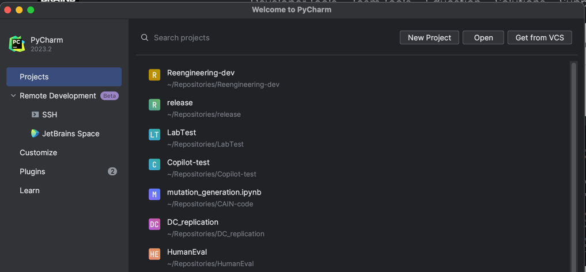
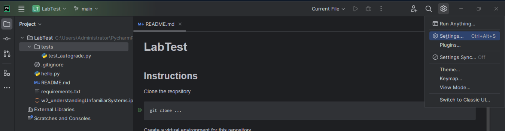
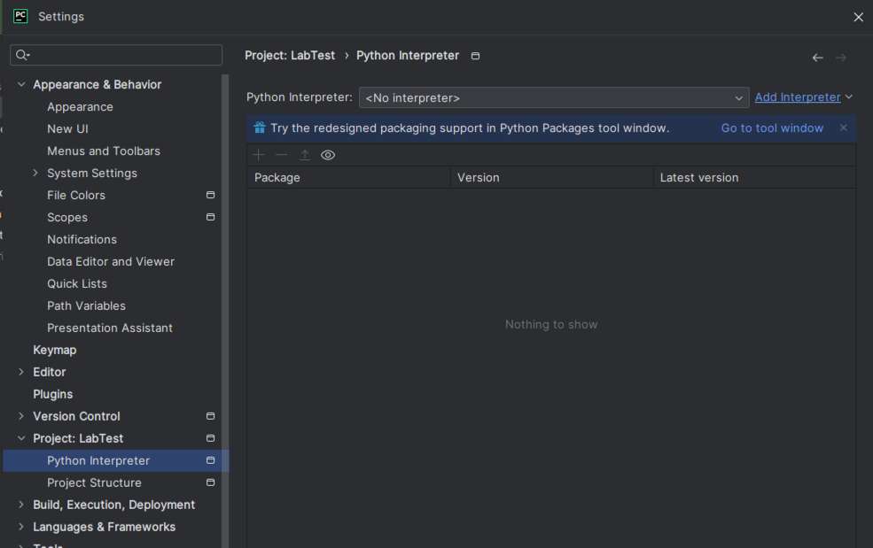
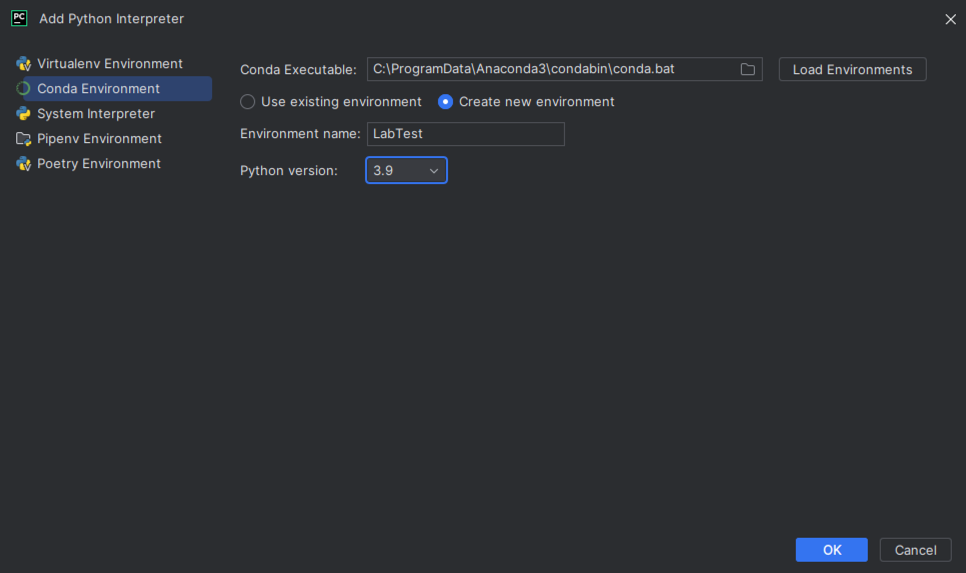
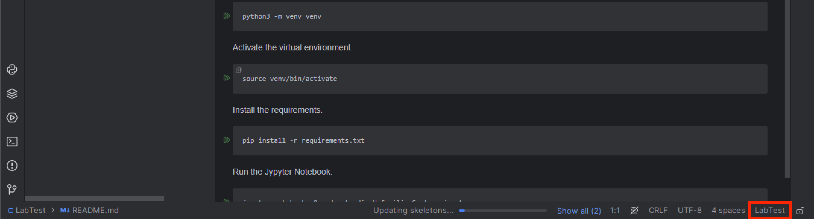
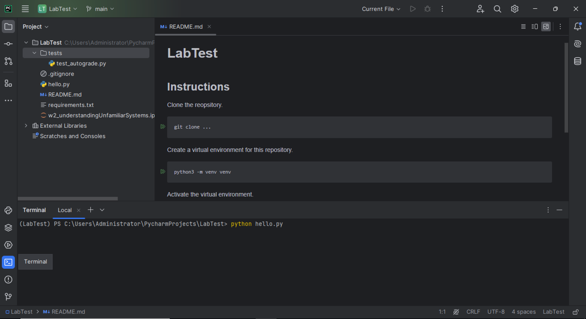
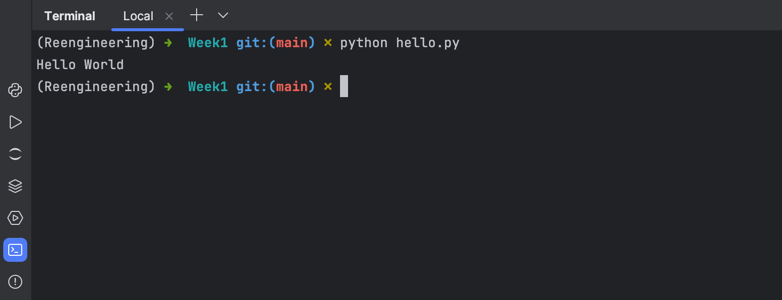

# Week 1: Getting Started

- In this week, we will set up the development environment for this module.
- We will use Git, Python (with virtual environments), PyCharm (IDE), and Jupyter Notebooks.
- Follow the instructions below to set up your development environment (without cloning this repository).
- If you are confident about Git, Python virtual envs, IDEs, and Jypyter Notebooks, jump to Section 5. 


Jump to:
- [1. Git](#1-git)
- [2. Python Virtual Envs](2-Python-Virtual-Environments)
- [3. PyCharm (IDE)](3-PyCharm-IDE)
- [4. Jupyter Notebooks](4-Jupyter-Notebooks)
- [5. Simple Exercise](5-Simple-Exercise)


## 1. Git

To use resources from GitHub, we need to install Git if not yet installed.
To check if your machine has Git installed, run the following command in your terminal:

```bash
git --version
```

If you get an error, you should install Git.

### How to Install Git (5-10 minutes)
You can download Git from [here](https://git-scm.com/downloads).
Simply download the installer for your operating system and follow the instructions.


## 2. Python Virtual Environments

To make it simple, we will use **Anaconda** to manage our Python virtual environments, including multiple Python versions.
- If you feel confident enough, you can use other tools, such as `pyenv` and `virtualenv`, and skip the rest of this section.
- However, all the instructions in the following weeks will be based on Anaconda.

Since we will use Python in this module, we need to install Python if not yet installed.
You can check this by running the following command in your terminal:

```bash
python --version
```

If you get an error, you should install Python.
Even without an error, you may want to install another version of Python.
Or, you may want to install multiple Python versions.
In fact, it is common to have multiple Python versions installed on your machine.
Furthermore, you may want to install different Python packages for different projects.
This is why a Python virtual environment is useful.

### How to Install Anaconda (10-15 minutes)
You can download Anaconda from [here](https://www.anaconda.com/download).
Simply download the installer for your operating system and follow the instructions.
If successfully installed, you should be able to run the following command in your terminal:

```bash
conda info
```

### How to Use Anaconda
You can create a new Python virtual environment, activate one of the existing environments, and install Python packages in the active environment.
To check the list of available environments, run the following command:

```bash
conda env list
```

To create a new environment, run the following command:

```bash
conda create --name <env_name> python=<python_version>
```
For example, you can use `conda create --name week1 python=3.9` to create a new environment named `week1` with Python 3.9.

To activate an environment, run the following command:

```bash
conda activate <env_name>
```

For more information, have a look at the conda cheat sheet [here](https://docs.conda.io/projects/conda/en/latest/user-guide/cheatsheet.html).


## 3. PyCharm (IDE)

PyCharm is an IDE (Integrated Development Environment) for Python.
- If you feel comfortable with other IDEs, such as VS Code, you can use them instead and skip the rest of this section.
- However, we will use PyCharm in this module, and all the instructions will be based on PyCharm.

### How to Install PyCharm (5-10 minutes)
As a student, you are eligible for a free PyCharm Professional license.
You can find more information [here](https://www.jetbrains.com/community/education/#students).

After getting the education license, you can download PyCharm Professional from [here](https://www.jetbrains.com/pycharm/download).

After installing PyCharm, you need to restart your computer.


### How to Use PyCharm
In PyCharm, you can create a new project from a Git repository, set up a Python virtual environment, and run Python scripts easily.

If you open PyCharm, you will be a screen like this:


You can Open an existing project or Create a new project.
Or, you can get an existing project from a GitHub repository by clicking on `Get from VCS`.

Since this repository (the one you are reading) is a working repository, you should create a new project from this repository.
(Here, if your machine does not have `git` installed, you will see `download and install git`; please do it first).

If `Get from VCS` does not work well, you can clone this repository somehow (e.g., using your terminal) and use `Open` instead.

Once you open a new project (either via `Open` or `Get from VCS`), you will see a screen like this:

Note that there is "No Interpreter" in the bottom right corner.
Without a specified Python interpreter, you cannot run Python scripts in this project.
Therefore, for every new project, you should set up a Python interpreter, which can be done by setting up a Python virtual environment.

If an automatic prompt appears, just follow it to set up a Python virtual environment.
Otherwise, go to "Settings" as shown below:


Then, go to "Project: <project_name>" -> "Python Interpreter" as shown below:


Click "Add Interpreter" and select "Add a local interpreter".
Among various options, select "Conda Environment" and "Create new environment".
Then, enter the name of the new environment (e.g., Reengineering), select the Python version you want to use (e.g., Python 3.9), and click "OK".


It will take some time to create a new Python virtual environment.
Later weeks, you can simply use the existing Python virtual environment (e.g., Reengineering) for other projects, unless a new clean environment is needed.

Once the Python virtual environment is created, you will see the Python interpreter in the bottom right corner.


Now, you can run Python scripts in this project.
Try to run `hello.py` by right-clicking on the file and selecting `Run 'hello'`.

Or, you can use a built-in terminal on the left bottom corner to run the script:


More information about PyCharm UI is available [here](https://www.jetbrains.com/help/pycharm/guided-tour-around-the-user-interface.html).


## 4. Jupyter Notebooks

Jupyter Notebook is a web-based interactive development environment.
- If you are already familiar with Jupyther Notebooks, you can skip the rest of this section.

Often we will give you a Jupiter Notebook file (`.ipynb`) for each hands-on exercise.
You should know how to run a Jupyter Notebook file.

In fact, it's simple. You can simply double-click a Jupyter Notebook file to open it in PyCharm.
Then, you can run each cell by clicking the "Run" button on the left side of the cell.

However, before you do anything, you should first install `jupyter` in your Python virtual environment.
PyCharm will ask you to install `jupyter` if you try to run a Jupyter Notebook file without `jupyter` installed.
You can simply click "Install Jupyter" to let PyCharm sorts it out for you.
Alternatively, you can install `jupyter` manually by running the following command in your terminal:

```bash
pip install jupyter
```

Note that you must activate your working Python virtual environment before installing `jupyter`.

Enjoy running Jupyter Notebook files in PyCharm!


## 5. Simple Exercise

Now, you have set up your development environment.

To check if everything works well, please edit line 3 of `hello.py` to print `Hello Reengineering`.
Then, run the script and check if it is printed correctly.



Finally, push your code to your repository, so we can see if you've done it.
To commit and push your change, you can use either PyCharm or your terminal.

In the build-in terminal, you can run the following commands:

```bash
git add hello.py
git commit -m "Change the print message"
git push
```

Done! You have completed the first week's exercise.
